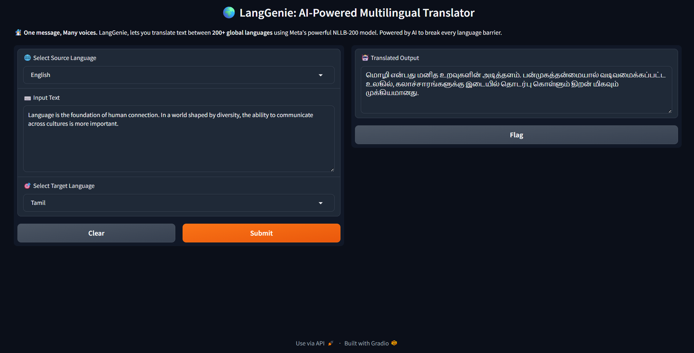

# 🌍 LangGenie - AI-Powered Multilingual Translator

LangGenie is an intelligent, user-friendly text translation app that supports *over 200 languages* using Meta’s *NLLB-200 (No Language Left Behind)* model. It allows you to convert text from *any language to any other* with just a click, all from a clean Gradio-based interface.

---

## 🚀 Features

- 🌐 Supports *200+ languages* using FLORES-200 codes
- ⚡ Fast and efficient translation with locally loaded model
- 🔄 Translates *from any source language to any target language*
- 🧠 Powered by Hugging Face Transformers and Meta’s NLLB-200
- 🖥 Beautiful and interactive web UI built with *Gradio*
- ✅ Works offline once the model is downloaded

---

## 📸 Preview

---

## 📦 Tech Stack

- Python 🐍
- Transformers by Hugging Face 🤗
- Meta AI’s NLLB-200 model 🧠
- Gradio for web UI 🎛
- PyTorch for model inference ⚙

---
